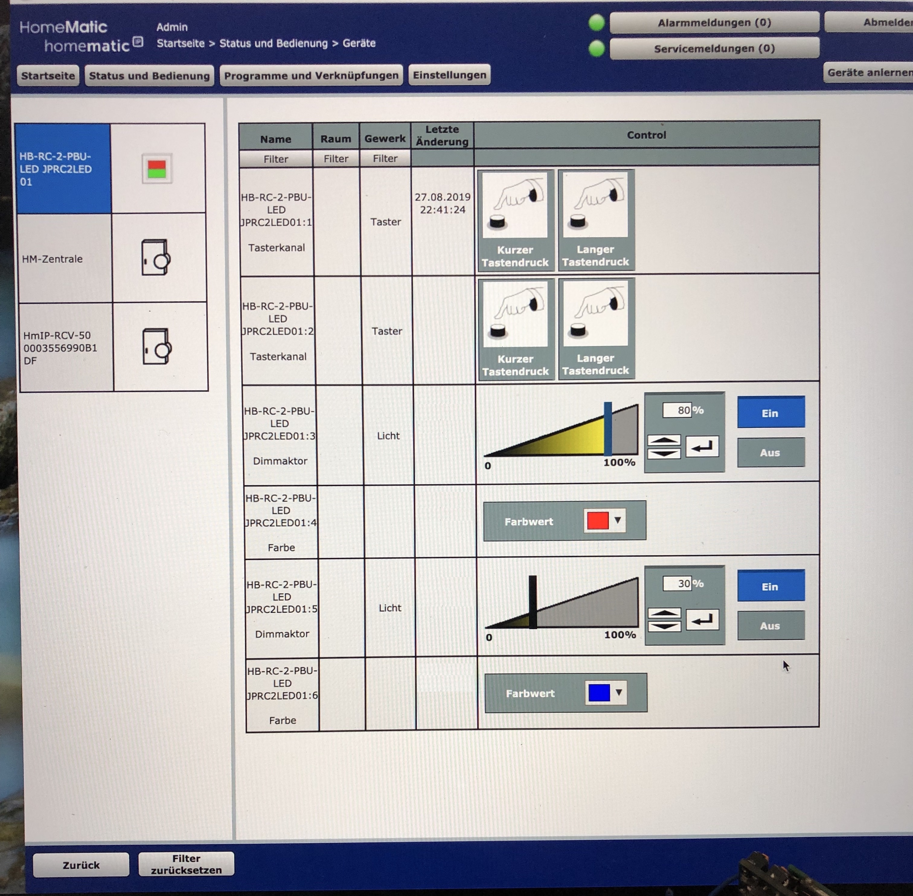

# HB-RC-2-PBU-LED

**2 fach Wandtaster, ähnlich dem [HmIP-BSL](https://www.elv.de/elv-homematic-ip-schaltaktor-fuer-markenschalter-mit-signalleuchte-hmip-bsl.html), mit RGB LED Beleuchtung (je 2 LED pro Schaltwippenhälfte (oben/unten)).**

